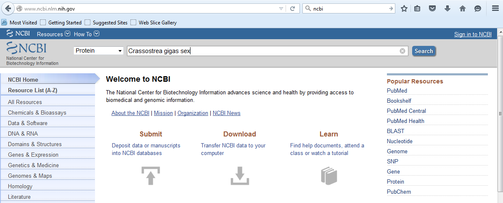
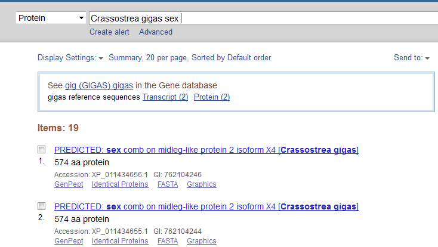
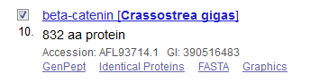
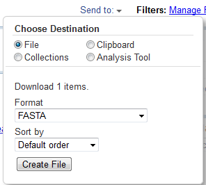
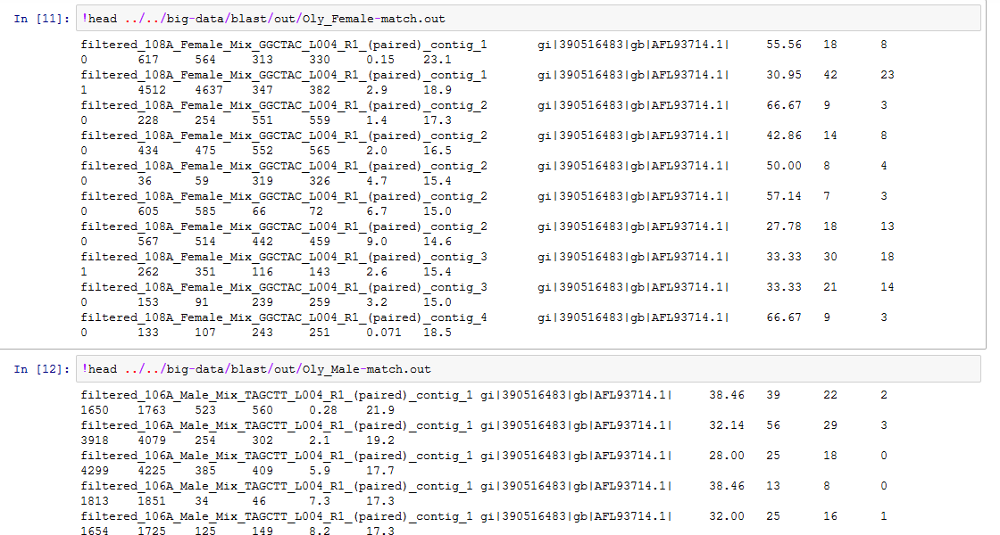
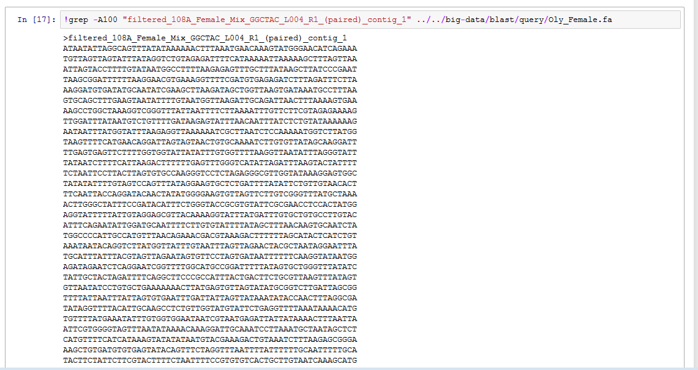

# My favorite gene
## by Fabiola Lafarga

### B-CATENIN
---
In mammals, β-catenin gene is a key player in female gonadic differentiation. In the other hand, in mollusks sex determination is poorly understood and Santerre et al. (2014) had recently described orthologs of this gene in the Pacific Oyster *Crassostrea gigas* (Cg-β-catenin) and proposed that this may be involved in early oyster gonadic differentiation, which includes sex determination. However, Cg-β-catenin gene expressions were localized from early germ cells to spermatocytes and pre-vitellogenic oocytes, and also expressed in vitellogenic oocytes. But Cg-β-catenin expression was maximal in mature females. 

Now we are going to try to look for Cg-β-catenin in transcriptomic sequences from gonadal tissue of males and females of Olympia oyster *Ostrea lurida*.

 

### Reference
Santerre, C., Sourdaine, P., Adeline, B., & Martinez, A. S. (2014). Cg-SoxE and Cg-β-catenin, two new potential actors of the sex-determining pathway in a hermaphrodite lophotrochozoan, the Pacific oyster *Crassostrea gigas*. Comparative Biochemistry and Physiology Part A: Molecular & Integrative Physiology, 167, 68-76.

[My Website at GitHub](https://github.com/lafarga13/faby2-btea-nb)
---

### First go to NCBI and pick up an interesting gene

[NCBI web page link](http://www.ncbi.nlm.nih.gov/)

In Protein Database search for “Crassostrea gigas sex” 
[Page link](http://www.ncbi.nlm.nih.gov/protein/?term=Crassostrea%20gigas%20sex)

We select  beta-catenin (AFL93714.1) 

and download these sequences in a FASTA format file (remember to rename the file when you have it in your computer download folder).

### Now get back to Jupyter

First open a new notebook from your terminal (Git Bash), for this exercise I create a notebook named “Finding sex genes related in bivalves (Day 3)”

[My phyton notebook](https://github.com/lafarga13/faby2-btea-nb/tree/master/jupiter)

And we are going to download the file with the sequences we will like to be our query files from 

[Course data web page](http://owl.fish.washington.edu/btea/index.php?dir=data%2F)

### I download the query files using next command lines:

!curl http://owl.fish.washington.edu/btea/data/Oly_Female.fa -o ../data/Oly-Female.fa

!curl http://owl.fish.washington.edu/btea/data/Oly_Male.fa -o ../data/Oly-Male.fa

### I create the database (db) using this command lines:

!makeblastdb -dbtype prot -in ../../big-data/blast/db/B-catenin_Cg_Prot.fasta \
-out ../../big-data/blast/db/B-catenin_Cg_Protein

!ls -s ../../big-data/blast/db/

#### resulting in three new files
B-catenin_Cg_Protein.phr

B-catenin_Cg_Protein.pin

B-catenin_Cg_Protein.psq

### Then I make a blastx (nucl to prot) using this command lines: 

# For females  

!blastx \
-query ../../big-data/blast/query/Oly_Female.fa  \
-db ../../big-data/blast/db/B-catenin_Cg_Protein  \
-task blastx \
-outfmt 6 \
-out ../../big-data/blast/out/Oly-Female-match.out

# For males
!blastx \
-query ../../big-data/blast/query/Oly_Male.fa  \
-db ../../big-data/blast/db/B-catenin_Cg_Protein  \
-task blastx \
-outfmt 6 \
-out ../../big-data/blast/out/Oly_Male-match.out

#### resulting in two new files

!ls -s ../../big-data/blast/out/

total 56116
26576 Oly_Female-match.out
29540 Oly_Male-match.out

### Then I check the matches blastx found:
 
!head ../../big-data/blast/out/Oly_Female-match.out

#### resulting in:

### Then I check the sequence in the original file (female file):
 
!grep -A100 "filtered_108A_Female_Mix_GGCTAC_L004_R1_(paired)_contig_1" ../../big-data/blast/query/Oly_Female.fa

#### resulting in:

### Then I leave it here CAUSE I NEED TO GO AND FEED ISABELLA !!!!!